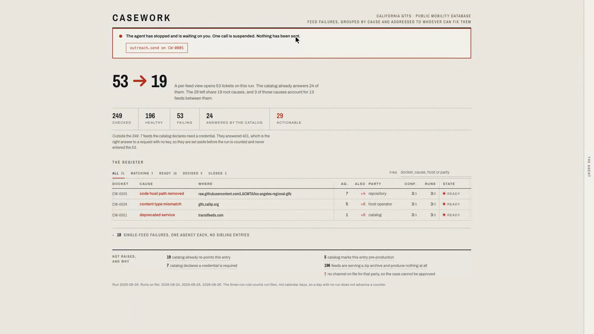
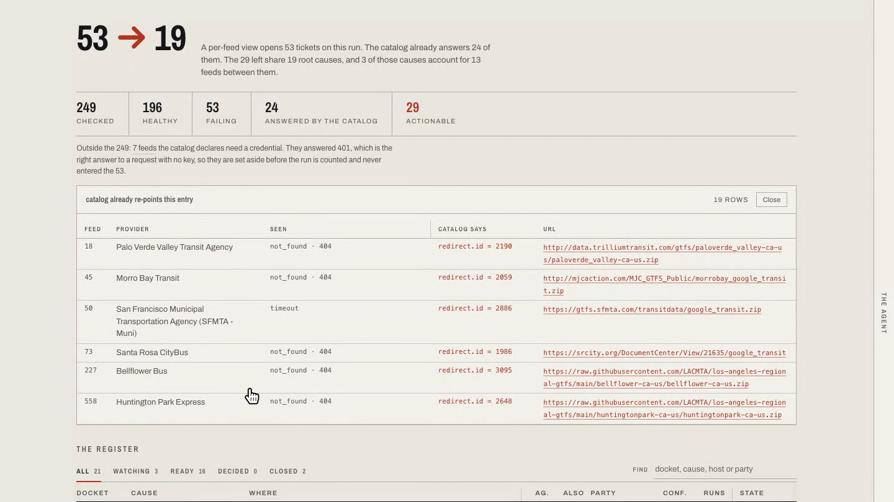
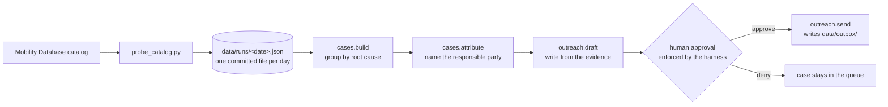
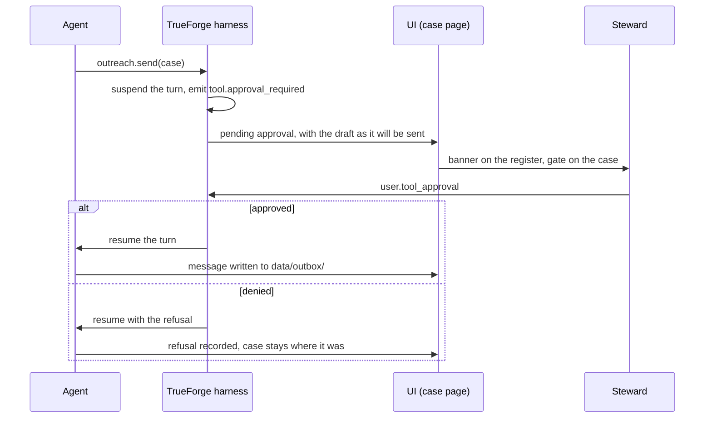
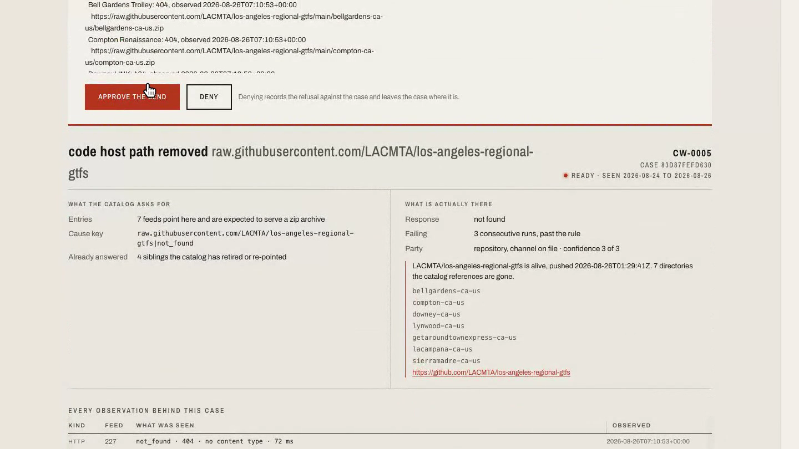
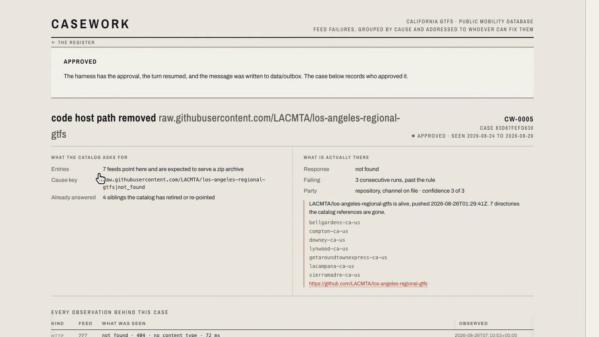

# Casework

[](https://github.com/sneg55/casework/actions/workflows/check.yml)
[](https://github.com/sneg55/casework/actions/workflows/capture.yml)
[](#licence)


An agent that works a transit data steward's feed-failure queue. It groups failures by shared
root cause, attributes each cause to the party who can actually fix it, drafts the outreach,
and stops for human approval before any message leaves.

Built on [TrueForge](https://github.com/truefoundry/trueforge) for the Agent Harness Hackathon
(2026-08-24 to 2026-08-30).



Status: the probe, the MCP server, attribution, the drafts, the gate and the screens all run.
The agent that drives them needs a TrueForge harness you supply. See
[`docs/SPEC.md`](docs/SPEC.md).

## The problem

A morning probe of a state's public GTFS catalog finds 53 feeds failing. The person on
rotation does not need 53 alerts. They need answers to two questions no dashboard gives them: how many
problems is this really, and who do I write to?

Spec validators answer "is this feed well formed". Scorecards answer "is it fresh". Alert
correlation platforms group *your* alerts, in *your* topology, for *your* team. None of them
crosses an organizational boundary. A transit steward's failures belong to other people: the
operator hosting the feed, the repository serving it, the catalog pointing at it. The work is
figuring out which, with evidence, and writing to them.

Get the grouping wrong and the cost is concrete. In the committed run, seven agencies are dark
because one GitHub repository that hosts GTFS on their behalf was reorganised and the paths the
catalog references are gone. Writing to seven city halls would be seven wrong emails. None of
them controls that repository.

And a checker that reads only the HTTP response opens tickets that should not exist. In the
same run, the catalog itself already answers 24 of the 53 failures: it marks 19 `deprecated`
with a named replacement feed, and five `development`, three of those under `/test/`. Another
seven feeds return 401 and are healthy, because the catalog records that they need an API key.
That is 31 tickets a naive checker opens against feeds nobody should be writing about.



## What casework does



The probe reads the public catalog and the feed URLs as published, and writes one run file per
day. Grouping folds failures that share a cause key into one case. Attribution is the step the
others exist for: it reads the GitHub API and re-probes replacement feeds to decide whether the
fault sits with the host operator, the repository, or the catalog, and it records the evidence
for that claim on the case. The draft is written from those observations, not from a template.
Then the agent stops, because sending is gated and the gate is not the agent's to open.

Run the probe against California's public GTFS feeds and the answer is not what the dashboard
shows:

```
  replay 2026-08-26, 2 prior run(s) on file
  checked 249   healthy 196   failing 53
  suppressed: 7 declare a credential, 24 the catalog has already retired or not yet shipped
  actionable failures 29

    7 agencies  raw.githubusercontent.com/LACMTA/los-angeles-regiona code_host_path_removed -> repository     run 3/3
      +4 corroborating: catalog already re-points this entry
    5 agencies  gtfs.calitp.org                                      content_type_mismatch  -> host_operator  run 3/3
      +5 corroborating: catalog marks this entry pre-production
      +1 corroborating: catalog already re-points this entry
    1 agency    transitfeeds.com                                     deprecated_service     -> catalog        run 3/3
      +6 corroborating: catalog already re-points this entry

  grouped 13 failures into 3 cases; 16 individual
  candidate causes 19, against 53 tickets a per-feed view would open
  past the 3-day rule, so drafted: 16
```

Every number above comes from `data/runs/2026-08-26.json`, which is committed, as are the
2026-08-24 and 2026-08-25 runs that give the same three causes at the same sizes. The counter
reads 3/3 because it counts those three files. There is no stored streak to fake, and until the
third file landed nothing could be drafted at all. Where `docs/SPEC.md` quotes 25, 20 and 32 in
the same three places, that is because it was measured against the 2026-08-24 run; both files
are checkable.

## The approval gate

`outreach.send` is the only approval-gated tool, and the gate is drawn on the case itself, not
in a chat transcript.



When the harness suspends the call, the notice opens with what is about to happen, the message
as drafted, and Approve or Deny. Approving is refused if the draft has changed since it was
shown. Denying records the refusal and leaves the case where it was, because a case nobody sent
to is still failing. No transport is wired, so an approved message is written to `data/outbox/`
and nothing leaves the machine.





## Try it

```bash
python3 scripts/probe_catalog.py --jurisdiction California
```

No credentials, no API key, nothing to install beyond Python 3.11. It reads the public
[Mobility Database](https://mobilitydatabase.org) catalog and writes the run to
`data/runs/<date>.json`. To replay a captured run offline, fetching nothing:

```bash
python3 scripts/probe_catalog.py --replay data/runs/2026-08-26.json
```

The 3-day rule counts the files in `data/runs/`, so the day counter is real history. A day
without a run leaves a gap in the dates and the counter does not move.

## Run the whole thing

Node 22+, Python 3.11+, and [uv](https://docs.astral.sh/uv/) for the Python dev tools. None of
it needs a credential to reach public data.

```bash
npm install && uv sync
cp registry.example.json registry.local.json   # who each party kind is written to

# 1. Capture a run. Writes data/runs/<date>.json. Skip it to work from the committed runs.
npm run capture

# 2. Build the cases and attribute them. Replays the runs on file; fetches no feeds.
npm run queue

# 3. The read API the screens are built on.
npm run api            # http://localhost:8791/api/queue

# 4. The queue and case screens.
npm run ui             # http://localhost:5273
```

`registry.local.json` maps a party kind to a channel. It is the only file that ever holds an
address, it is gitignored, and `outreach.send` reads it at send time and nowhere else. The
example ships `.invalid` placeholders, so you can run the whole path without writing to
anybody. Skip the copy and every case reads as having no channel and cannot be approved, which
is what should happen.

Step 2 attributes as well as groups. A case with no attribution has no party to write to, and
the queue row says so. Attribution reads the GitHub API and re-probes replacement feeds, so it
is the one step that touches the network after a run is captured.

## The agent, and how TrueForge holds it

A steward opens the dock, says "work the queue", and the agent does one pass of the standing
orders: `cases.build`, `cases.attribute`, `outreach.draft`, stop. Approving is the steward's
move, and the agent cannot make it.

The harness is what makes the stopping real rather than a promise in a prompt.
[`agent/casework.agent.json`](agent/casework.agent.json) is a TrueForge AgentSpec, and four
parts of it carry the design:

- `model.name` is `anthropic/claude-sonnet-5`, resolved against a provider key held in the
  harness settings. No key, no model name and no address is in this repository.
- `skills` references `casework-sop` by name. The body is
  [`skills/casework-sop/SKILL.md`](skills/casework-sop/SKILL.md) and the mount comes from the
  harness skill store, so the rules the agent follows are registered, versioned and swappable
  without touching the agent.
- `mcp_servers` registers `casework` and preloads `cases.list` and `cases.build`, so the first
  turn opens on the real queue instead of on the agent asking what it is looking at. The
  harness registers remote servers only, which is why `casework-mcp` also serves streamable
  HTTP on `:8792`.
- `require_approval_for_tools: ["outreach.send"]` is the gate. When the agent reaches that tool
  the harness suspends the turn and emits `tool.approval_required`; nothing runs until a
  `user.tool_approval` item allows or denies it. The gate is enforced by the harness, above the
  tool, so a persuaded or confused agent cannot route around it.

`sandbox`, `dynamic_sub_agents`, `generative_ui`, `ask_user_questions` and context compaction
are on.

To run it: start the harness with `npx @truefoundry/trueforge`, which runs standalone on
`:8790` against its own SQLite and needs no TrueFoundry account. A provider API key is entered
in the harness itself and never reaches this repository. Then register the `casework-sop` skill
and `casework-mcp`, which the harness reaches over HTTP on `http://localhost:8792/mcp`
(`npm run mcp`). Set `CASEWORK_HARNESS_ORIGIN` and leave `VITE_CASEWORK_HARNESS_URL=/harness`:
the dock reaches the harness through the Vite proxy, because a standalone harness sends no CORS
headers. Leave it unset and the dock tells you what to set. The whole sequence, with the API
calls that do the registering, is in [`agent/README.md`](agent/README.md).

The chat dock is a second view, not the path to approval. It mounts TrueForge's own chat shell,
which currently throws on mount for a reason two packages upstream; the error boundary contains
it and the register and the gate are unaffected. See "Known and not fixed".

## Working on it

```bash
npm install          # workspace: packages/mcp, packages/ui
uv sync              # ruff, pytest, pyright
npm run check        # biome, eslint, tsc, vitest, ruff, pytest
```

Layout and the rules that govern changes are in [`CLAUDE.md`](CLAUDE.md); the build design is
[`docs/SPEC.md`](docs/SPEC.md).

## Known and not fixed

Two things are broken and disclosed rather than worked around.

The chat dock does not render. `@truefoundry/trueforge-ui` mounts and throws
`Maximum update depth exceeded` from `UseTapEffects` inside `AuiProvider`, in
`@assistant-ui/store`. Both packages are at their latest published version, so there is no
upgrade to take. A React error boundary contains it, so the register and the approval gate are
unaffected, and the case page offers the request to copy so the work is not lost. This is why
the gate is drawn by this app rather than left to the chat.

The `casework-sop` skill does not clone inside the local sandbox. The harness registers it,
then its git clone fails on a macOS developer-tools error. `git ls-remote` on the same URL
succeeds from a stripped shell, so it looks environmental rather than wrong in the skill. The
agent runs on its AgentSpec instructions without the SOP body mounted.

## What this is not

Alert correlation is a mature commercial category, and the grouping step here is its commodity
part. This project is about the step after it: attributing a fault to an organization outside
your own, and drafting the request to them.

Casework does not validate feeds. Free tools own that job and it consumes their verdict. It
does not touch GTFS-Realtime or WZDx, and it does not edit anybody's data.

## Qodo code review evidence

Every pull request in this repository is reviewed by
[Qodo](https://github.com/marketplace/qodo-merge-pro), and the review is public.

Two pull requests are worth reading in full.

[**PR #2**](https://github.com/sneg55/casework/pull/2) is where it caught what the product
says. Qodo returned three correctness bugs, all of them real, all of them mine:

- `investigateTransport` and `investigateContent` re-probe through the same code, so their
  evidence carried the same `http` kind. The case page could not tell them apart and described
  an unreachable host as one that "served no archive", which answers a question nobody asked.
  It now branches on `cause_kind`.
- The archive count and the phrase "the rest" were computed over different populations, so a
  partially healthy host could be told that "the rest answered application/zip" above a quoted
  `PK` and a line explaining that a zip archive begins `PK`.
- The store marks a case `resolved` on its own when it stops appearing in a run, and the empty
  Ready tab called that a decision, crediting a steward with a call they never made.

The re-review then raised a rule violation worth more than the bugs: `auth_rejected` was routed
through the transport investigation while section 9 of [`docs/SPEC.md`](docs/SPEC.md) documented
that investigation for two cause kinds only. The gap was older than the pull request. Section 6
declares nine cause kinds and the section 9 table covered eight. The spec now carries the row,
and a test fails the build if the two ever disagree again.

Two of the repository's own tests had been asserting the buggy strings and were corrected
alongside the code. One passed on a substring while the sentence it covered was nonsense, which
is how the second bug survived to review in the first place.

[**PR #5**](https://github.com/sneg55/casework/pull/5) is the one where the review caught
something a judge could have hit. Qodo returned two bugs and two rule violations, then a fifth
finding on the follow-up pass:

- Unauthenticated MCP network exposure, its only High. The new HTTP door bound every interface
  and sent `Access-Control-Allow-Origin: *`, in front of `outreach.decide` and `outreach.send`.
  Fixed, but not the way Qodo proposed: it suggested a bearer token or an origin allowlist, and
  the narrower answer was that nothing in `packages/ui` addresses that port at all, so the CORS
  headers went away entirely and the listener took a bind host that defaults to loopback.
  Checked both ways before the fix was called done: `127.0.0.1:8792` answers, the machine's LAN
  address is refused.
- A captured run file was overwritten. The capture workflow committed
  `data/runs/2026-08-26.json` at 07:10 and a local capture at 09:59 replaced it. That is a
  rewrite of a run, not a second run, and this repository's rules forbid it. The committed file
  is restored byte for byte. The numbers that follow from it moved in the product's favour: the
  third run is what makes the 3-day rule fire, so the README block went from `drafted: 0` to
  `drafted: 16`.
- The HTTP transport was undocumented in the spec, the same class of violation the re-review
  raised on PR #2 and the reason the rule exists. Section 5 now documents both doors.
- `/harness` is a Vite dev-server rule and a build baked it in anyway, so a built dock would
  have called itself. The build now refuses.
- On the follow-up pass, against the fixes: moving the env read to the repository root left
  `.env.example` telling a judge to write `packages/ui/.env.local`, which nothing loads.
  Confirmed by building with a marker value in that path and grepping the bundle for it.

Four of the five are marked resolved on the final review. The fifth, the captured run, is a
stale marker: the file is byte-identical to `main` and does not appear in the pull request's
diff at all.

Qodo runs automatically when a pull request is opened. It is also invoked with `/review` on a
pull request that predates the app.

## AI assistant disclosure

The event rules require this. The project was built with AI coding tools. I have reviewed and
understood the design decisions, the evidence behind them, and the code as submitted.

## Licence

MIT.
